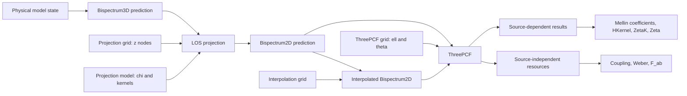

# State and cache management for the fastnc calculation pipeline

Status: Development note. This document records the current design discussion
and is not yet a normative public API contract.

## Objective

The pipeline must support repeated cosmological inference in which physical
model parameters change at every likelihood evaluation while numerical grids
and transform hyperparameters remain fixed. Expensive source-independent
objects, especially the Slepian regular matrix `F_ab`, must survive changes of
cosmology, redshift-dependent spectra, term amplitudes, and even replacement
of the complete bispectrum model. Only quantities that depend on the changed
input should be invalidated.

The governing principle is therefore:

> A change invalidates a cached object if and only if that cached object's
> mathematical inputs have changed. Source identity is not itself a
> mathematical input.

The current single `Bispectrum.state_token` is too coarse. `ThreePCF` responds
to any token change by discarding its Slepian calculator, which also discards
Weber kernels and `F_ab`. This is correct but defeats the intended reuse during
MCMC and model comparison.

## Three kinds of information

### Prediction state

Prediction state comprises inputs that change the value returned by a source
at fixed public coordinates. Examples are cosmology, power spectra, bias and
halo parameters, redshift-dependent amplitudes, LOS distances and kernels,
and the values stored in an interpolation table. Downstream result tables must
be recomputed when prediction state changes.

The downstream-facing name should be `prediction_state_token` rather than
`model_state_token`: changing an interpolation grid or replacing a projector
also changes the numerical prediction even though it is not a physical model
parameter.

### Immutable structure

Term names, available representation types, Slepian angular orders, constant
legs, separability, and projection strategy describe the mathematical form of
the source. These are currently fixed by frozen representations and term
construction. They should be represented by an immutable
`structure_signature`, not a mutable revision counter. A structural change
creates a new term or bispectrum object.

The signature is useful for matching an incoming source to existing
source-independent resources. It must be based on mathematical content and
must not contain Python object identities.

### Computational hyperparameters

Computational grids and tolerances belong to the stage that uses them. There is
no single global "grid state". In particular:

- a Bihalofit `k,z` table is model input and changes the source prediction;
- projector `z` nodes are projection hyperparameters;
- interpolation triangle nodes are interpolation hyperparameters;
- ThreePCF `ell,theta` nodes are transform hyperparameters;
- the Slepian regular `x` grid is a Slepian transform hyperparameter.

The fact that all are arrays called grids does not give them the same cache
semantics.

## Pipeline ownership



Each stage owns its own immutable hyperparameters. A pipeline-level object may
compose their signatures, but ownership should not be collapsed into one large
configuration merely to simplify invalidation.

## Source-independent and source-dependent objects

For fixed ThreePCF hyperparameters, the following are independent of the
bispectrum source:

- `TunedFFTGrid` geometry;
- multipole coupling matrices;
- angular quadrature nodes and weights;
- `WeberGeometry` and primitive Weber values;
- constant-leg kernels;
- full regular Mellin matrices `F_ab`;
- low-rank factors of `F_ab`.

The following depend on source values and must be recomputed after replacing
Bihalofit by one-halo, changing cosmology, or changing a projection:

- sampled bispectrum values;
- bispectrum multipoles;
- sampled Slepian radial factors;
- one-dimensional FFTLog/Mellin coefficients;
- `HKernel` values;
- `ZetaK` and `Zeta` values;
- source-derived interpolation tables.

The regular contribution has the explicit separation

```text
ZetaK(theta1, theta2)
  = sum_(a,b) c_double[a] c_single[b] F_ab(theta1, theta2).
```

`F_ab` depends on Mellin exponents, Bessel orders, target and integration
geometry, and numerical controls. It does not depend on the Mellin
coefficients. Replacing a bispectrum therefore does not invalidate an existing
`F_ab`. A new angular-order combination may require an additional cache entry,
but old entries remain correct.

## Projector classification

`LOSProjector` stores `z`, `chi`, kernels, prefactor, shift, and the quadrature
rule. This is also the target ownership model: a configured projector owns its
immutable LOS grid for every route. Physical and numerical projection metadata
remain distinguishable for cache signatures, but their public owner does not
change between routes.

`los.project(b3d)` constructs a `Bispectrum2D` whose projected term
representations retain the source representation and the same projector.
Numeric evaluation can therefore perform bispectrum-level LOS integration and
support `b2d.evaluate(...)` without an external context. Slepian and
semi-analytic calculators obtain the projector from their projected
representations and use its grid for result-level or coefficient-level
integration.

Projection history is a representation-level property, not a bispectrum-wide
flag. A `Bispectrum2D` may mix native and projected terms. `ThreePCF` therefore
dispatches on representation capabilities or concrete representation types;
it must not inspect `b2d.is_projected` and apply one global branch.

Projection structural hyperparameters:

- redshift integration nodes;
- quadrature rule and integration variable;
- projection strategy and coefficient layout;
- sample-combination structure.

Projection prediction state:

- `chi(z)` for the current cosmology;
- lensing and source kernels;
- cosmology-dependent prefactors;
- all values used to map `ell` to `k=ell/chi(z)`.

During MCMC, `z` nodes normally remain fixed while `chi(z)` and kernels change.
The projected bispectrum and LOS-integrated Mellin coefficients must change,
but the ThreePCF `F_ab` remains valid. Replacing the frozen projector object is
the current update mechanism; its signatures must distinguish physical values
from the immutable grid so downstream caches invalidate selectively.

The transform basis is defined on the `ell` grid owned by `ThreePCF`, not on a
comoving `k` grid. Cosmology and redshift enter source evaluation through
`k=(ell+shift)/chi(z)`. They therefore change Mellin coefficients and LOS
contractions, but do not invalidate Weber tables or `F_ab` while the `ell`
grid, Mellin indices, Bessel orders, and target geometry remain fixed.

### Projection stages

Projection may be inserted at three different stages.

1. Bispectrum-level projection constructs an evaluable `Bispectrum2D`. A
   change of LOS grid or projection physics changes that source prediction.
2. Result-level projection computes an `HKernel`, `ZetaK`, or `Zeta` at each
   redshift and integrates those results. New LOS nodes require new per-node
   source results, but not new transform kernels.
3. Coefficient-level projection evaluates redshift-dependent Mellin
   coefficients and contracts them directly with the low-rank factors of the
   source-independent `F_ab` at each LOS node. It then integrates the reduced
   rank-space integrand. A dense LOS-integrated matrix `bar_C_ab` is never
   constructed or cached. New LOS nodes invalidate coefficient samples and
   their reduced contractions, while `F_ab` is retained.

If `F_ab = sum_r s_r u_ar v_br` and the coefficient matrix at one redshift is
`c_a(z) d_b(z)`, the implemented order is

```text
alpha_r(z) = sum_a u_ar c_a(z)
beta_r(z)  = sum_b v_br d_b(z)
integrand(z) = sum_r s_r alpha_r(z) beta_r(z)
result = LOS_integral[integrand(z)]
```

The formal matrix `bar_C_ab = LOS_integral[c_a(z) d_b(z)]` generally has rank
up to the number of LOS nodes. Materializing it would discard the useful
quadrature factorization and reduce the speed benefit of low-rank `F_ab`.

Accordingly, state signatures must be granular even though their owner is
shared: `projector.grid_signature`, `projector.physical_state_token`, and
`threepcf.transform_signature` replace a single global projector revision.

## Interpolation classification

`TriangleInterpolationConfig` and its triangle grid are immutable
hyperparameters of an interpolated representation. Changing them creates a new
interpolated bispectrum and changes the prediction observed by ThreePCF. A
change of the source cosmology rebuilds values on the same interpolation grid.

From ThreePCF's perspective both events replace the source prediction. Neither
event changes the ThreePCF transform grid, and neither should invalidate
source-independent Slepian resources.

## Proposed common API

Bispectra and derived source objects should expose:

```python
@property
def prediction_state_token(self) -> tuple:
    ...

@property
def structure_signature(self) -> tuple:
    ...
```

Mutable physical model classes increment a prediction revision through a
uniform internal method such as `_prediction_updated()`. Frozen term and
representation objects do not need revision counters. Their structure
signature is derived from immutable mathematical metadata.

The existing `state_token` may temporarily alias `prediction_state_token` for
compatibility. It should no longer imply that every downstream resource must
be discarded.

## Proposed ThreePCF invalidation

`ThreePCF` should split the current broad clearing operation into:

```python
def _clear_source_results(self):
    ...

def _clear_structural_resources(self):
    ...
```

Replacing a source or observing a new prediction token clears source-derived
values but preserves structural resources. Changing `ell`, `theta`, spin,
basis, route hyperparameters, FFTLog controls, or Weber/regular controls clears
the affected structural resources as well.

The Slepian calculator needs corresponding public-internal operations:

```python
clear_source_state()       # radial samples and Mellin coefficients
clear_structural_state()   # Weber, F_ab, and low-rank resources
clear()                    # both
```

Its caches should be grouped as follows:

```text
source cache
    radial samples
    FFTLog/Mellin coefficients

structural cache
    Weber geometries
    Weber primitive/interpolation values
    constant-leg kernels
    full F_ab
    low-rank F_ab factors
```

## Invalidation matrix

| Change | Projection resources | ThreePCF structural resources | Source results |
|---|---|---|---|
| cosmology or bias | update physical values | keep | recompute |
| replace Bihalofit by one-halo | keep fixed operator | keep matching entries | recompute |
| `chi(z)` or LOS kernels | recompute projection values | keep | recompute |
| projector `z` nodes | rebuild projection grid resources | keep | recompute |
| interpolation grid | rebuild interpolation table | keep | recompute |
| Slepian angular orders | keep projection resources | retain old `F_ab`, add missing key | recompute |
| ThreePCF `ell` grid | possibly keep projection nodes | rebuild dependent resources | recompute |
| target `theta` grid | keep projection resources | rebuild theta-dependent resources | recompute |
| output `phi` grid | keep | keep | recompute `Zeta` only |

## Classes requiring state participation

State producers or aggregators:

- `Bispectrum3D` and `Bispectrum2D`;
- SPT, one-halo, NFW, and Bihalofit model subclasses;
- projected, composed, and interpolated bispectra, which forward source tokens;
- a future mutable projector, if introduced.

Cache observers or owners:

- `ThreePCF`;
- `SlepianCalculator`;
- `InterpolatedNumericRepresentation2D`;
- `BruteForceX3PCF`;
- future coefficient-level LOS calculators.

Passive immutable objects should not receive mutable state machinery. This
includes configs, support objects, term keys, grids as value objects, result
tables, `RegularMellinMatrix`, and `LowRankRegularMellinMatrix`.

## Implementation order

1. Introduce `prediction_state_token` and `structure_signature` on
   `Bispectrum3D/2D`, retaining `state_token` as a compatibility alias.
2. Rename model mutation notification to `_prediction_updated()` and update
   all physical model subclasses.
3. Propagate prediction tokens and structure signatures through projection,
   interpolation, selection, scaling, and composition.
4. Split Slepian source caches from structural caches and test selective clear.
   This is implemented for FFTLog power sums versus Weber, geometry, and
   regular-matrix resources.
5. Change `ThreePCF` source synchronization and `set_bispectrum()` so they
   preserve structural resources.
6. Update interpolation and brute-force observers to use prediction tokens.
7. Keep the projector immutable while coefficient-level LOS evaluation is
   established. If mutable projector updates are introduced, separate its LOS
   grid signature from its physical-weight token before adding projector-owned
   caches.
8. After behavior is stable, consolidate cache and state-change logging as
   recorded in `docs/todo.md`.

Every step must test both correctness after mutation and preservation of
unaffected cache object identities or build counts. In particular, tests must
replace an entire bispectrum model while demonstrating that matching `F_ab`
and Weber entries are reused.
